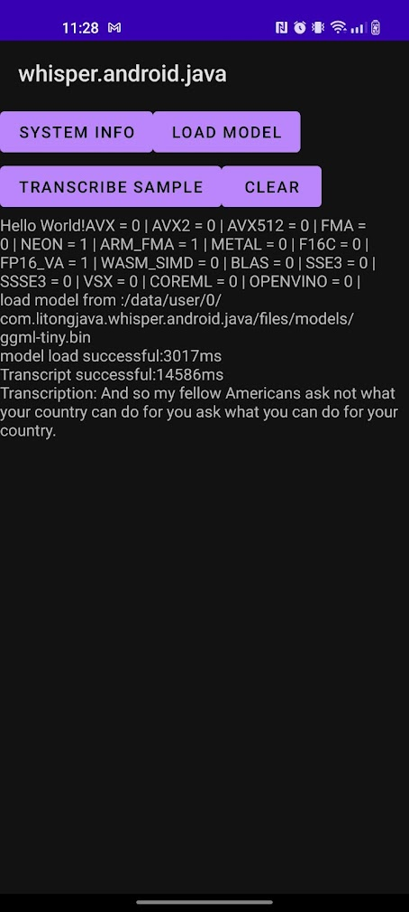

A sample Android app using java code and [whisper.cpp](https://github.com/ggerganov/whisper.cpp/) to do voice-to-text transcriptions.

To use:

1. Select a model from the [whisper.cpp repository](https://github.com/ggerganov/whisper.cpp/tree/master/models).[^1]
2. Copy the model to the "app/src/main/assets/models" folder.
3. Select a sample audio file (for example, [jfk.wav](https://github.com/ggerganov/whisper.cpp/raw/master/samples/jfk.wav)).
4. Copy the sample to the "app/src/main/assets/samples" folder.
5. Modify the modelFilePath in the WhisperService.java
6. Modify the sampleFilePath in the WhisperService.java
7. Select the "release" active build variant, and use Android Studio to run and deploy to your device.
[^1]: I recommend the tiny or base models for running on an Android device.

PS:  
1. Do not move this android project folder individually to other folders, because this android project folder depends on the files of the whole project.  
2. The cpp code is compiled during the build process  
3. If you want to import a compiled cpp project in your Android project, please refer to the https://github.com/litongjava/whisper.cpp.android.java.demo  

